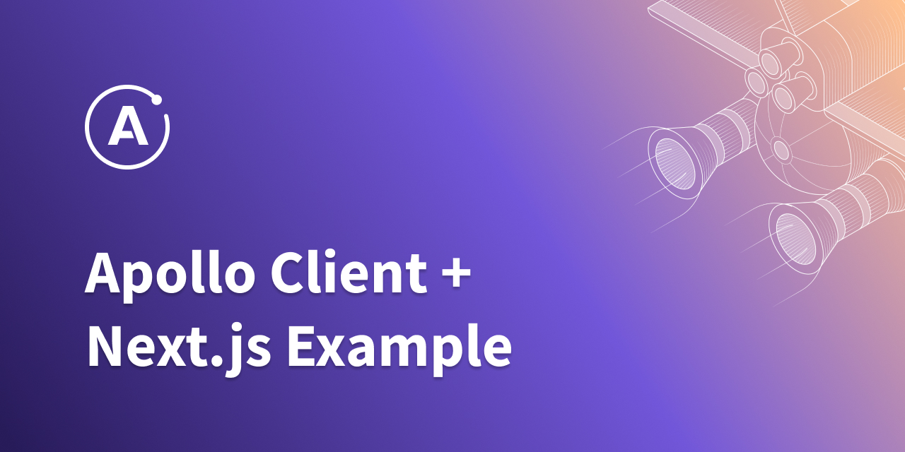

  
  
A template for creating minimal reproductions with <a href="https://github.com/vercel/next.js">Next.js</a> and <a href="https://github.com/apollographql/apollo-client">Apollo Client</a>.

## Usage

### GitHub

Fork the repository, install its dependencies with `npm i` and run it locally with `npm run dev`. Commit + push your changes and share a link to your forked repository with a member of the [Apollo Client team](https://github.com/apollographql/apollo-client#maintainers).

### CodeSandbox

Fork the CodeSandbox (https://codesandbox.io/s/github/apollographql/next-apollo-example) and share a link to your reproduction with a member of the [Apollo Client team](https://github.com/apollographql/apollo-client#maintainers).